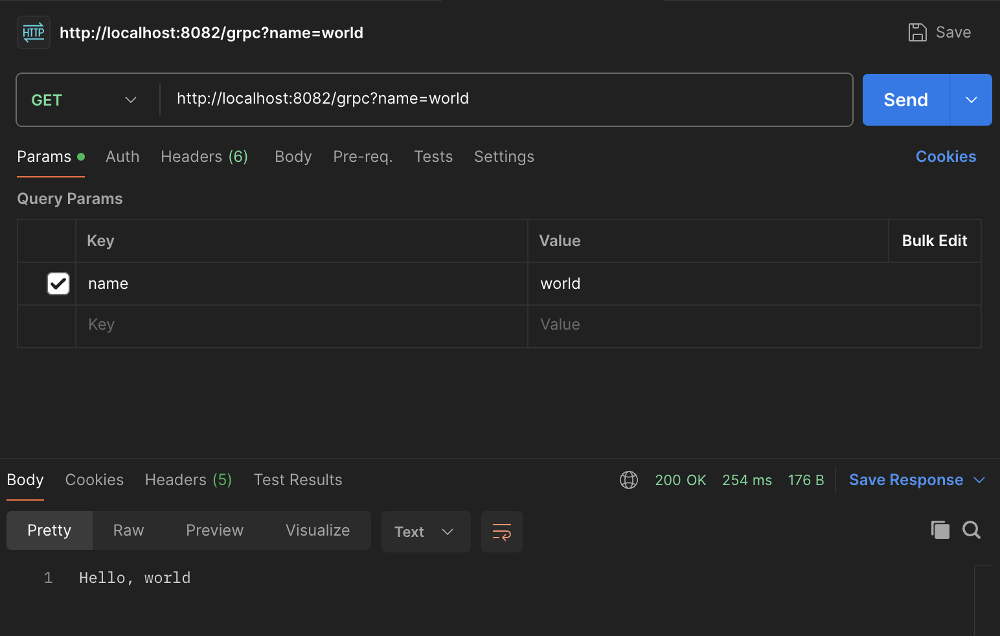
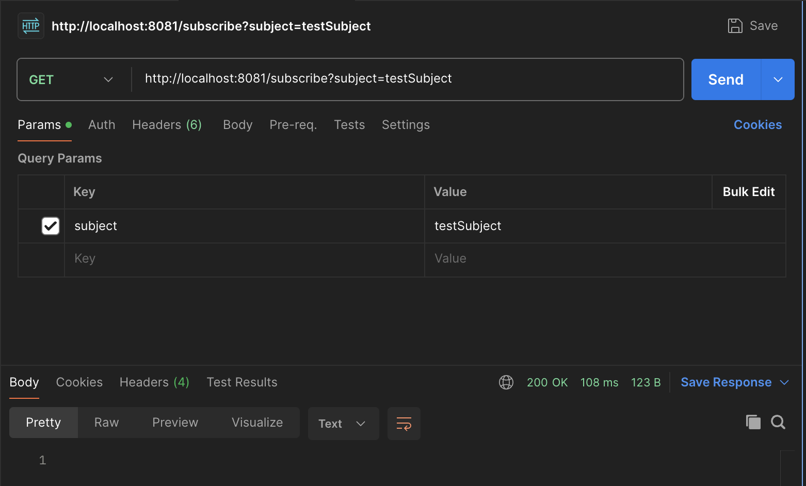
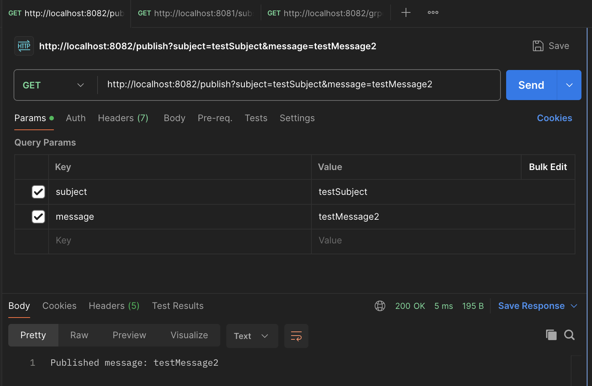
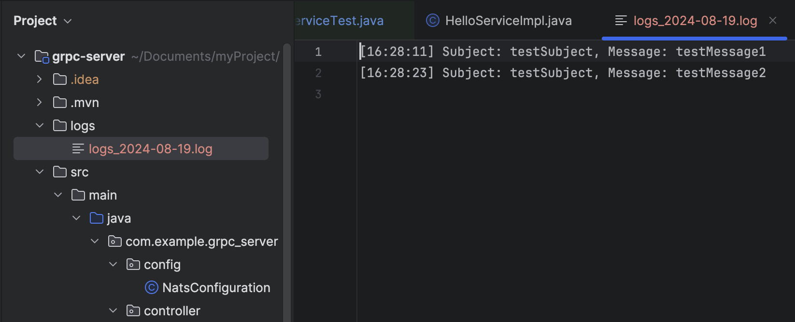

  <h3 align="center">Nats-GRPC-Example</h3>

  

    📌목표: 스팸필터링 리빌딩 프로젝트에 실제 적용하기 전, 간단한 테스트 용 예제 프로젝트로 실습

<!-- ABOUT THE PROJECT -->
## 예제 프로젝트 구조

* gRPC Server Project (Project A) : gRPC 서버를 실행하여 gRPC 요청을 처리한다.

* gRPC Client & NATS Project (Project B) : gRPC 클라이언트를 통해 Project A에 요청을 보내고, NATS를 통해 메시지를 주고받는다.

## 예제 프로젝트 요구사항

1. gRPC 서버 간 호출 : 

⇒ 클라이언트 프로젝트에서 ‘sayHello’ 요청을 보내면 서버 프로젝트에서 응답메시지가 반환된다.

2. NATS를 통한 메시지 발행과 구독 :

⇒ 클라이언트 서버에서 NATS 메시지를 발행하면, 해당 주제에 대해 구독하고 있는 서버에서 메시지를 수신하여 로그파일안에 기록한다.

## 테스트 기능

1. gRPC 서버 간 호출 테스트 :

 * 시나리오: 클라이언트에서 gRPC 서버로 요청을 보내고, 올바른 응답을 수신하는지 확인한다.

 * 테스트 방법 : 

Postman 또는 웹 브라우저에서 http://localhost:8082/grpc?name=world을 호출하여 서버로부터 "Hello, world" 응답을 받는지 확인한다. 

NATS 메시지 발행 및 구독 테스트 :

* 시나리오: 클라이언트에서 NATS 메시지를 발행한 후, 해당 메시지를 구독하여 올바르게 수신하여 저장되는지 확인한다.

* 테스트 방법 : 

1) http://localhost:8081/subscribe?subject=testSubject를 호출하여 ‘testSubject’라는 주제로 발행된 메시지의 구독을 시작한다.

2) http://localhost:8082/publish?subject=testSubject&message=testMessage1를 호출하여 메시지를 발행한다.

3) logs 폴더안에 날짜별로 로그파일이 생성되고 발행된 메시지가 정상적으로 수집되는지 확인한다.

## 테스트 결과

[gRPC 서버 간 호출 테스트]

<figure>
    
  <figcaption>결과 : 클라이언트 서버에서 name 값으로 ‘world’ 를 설정하여 호출 후, grpc서버를 통한 응답메시지 수신 확인</figcaption>
</figure>

[NATS 메시지 발행 및 구독 테스트]

<figure>

1. grpc 서버 프로젝트에서 ‘testSubject’라는 주제 구독시작

    
</figure>

<figure>

2. grpc-nats-client 프로젝트에서 ‘testSubject’라는 주제로 ‘testMessage1’이라는 메시지와 ‘testMessage2’ 메시지를 순차적으로 발행

    
</figure>

<figure>

3. 구독중인 grpc 서버에서 메시지 발행 후 로그파일 기록으로 정상 수집확인.

    
</figure>

